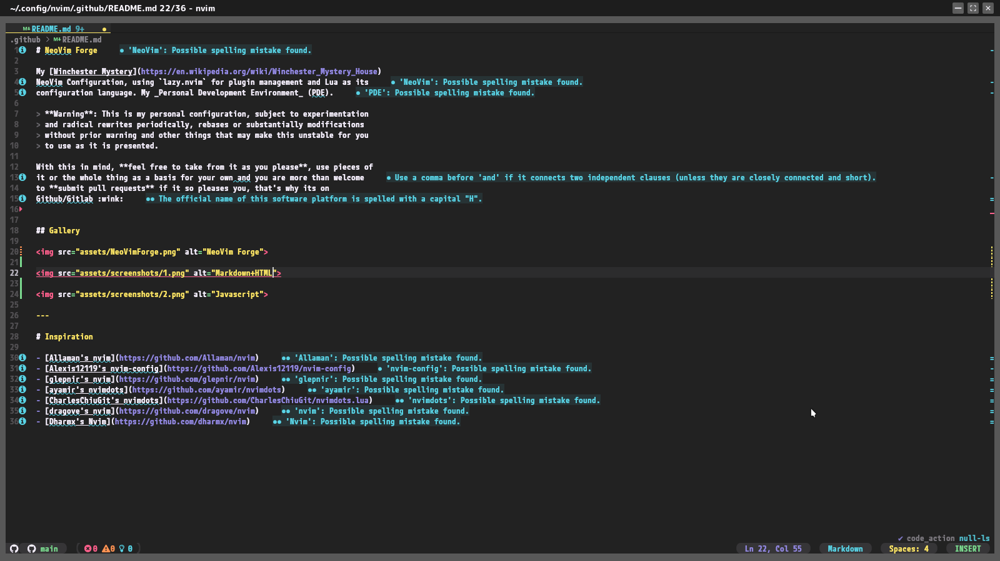
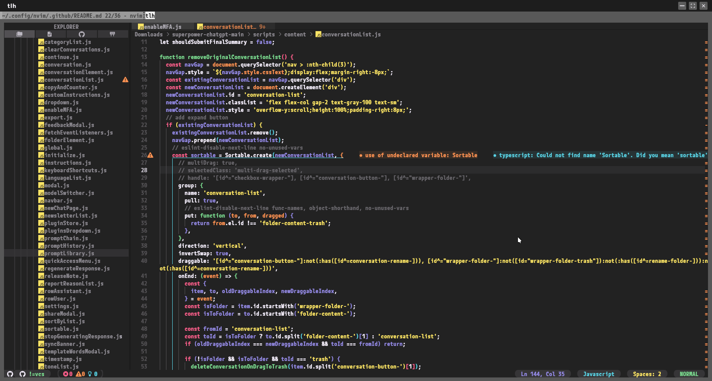
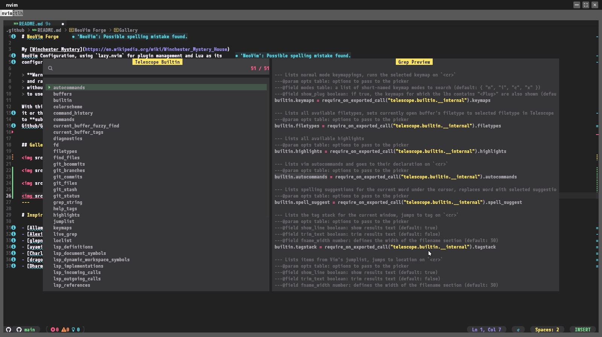

# NeoVim Forge

My [Winchester Mystery](https://en.wikipedia.org/wiki/Winchester_Mystery_House)
NeoVim Configuration, using `lazy.nvim` for plugin management and Lua as its
configuration language. My _Personal Development Environment_ (PDE).

> **Warning**: This is my personal configuration, subject to experimentation
> and radical rewrites periodically, rebases or substantially modifications
> without prior warning and other things that may make this unstable for you
> to use as it is presented.

With this in mind, **feel free to take from it as you please**, use pieces of
it or the whole thing as a basis for your own and you are more than welcome
to **submit pull requests** if it so pleases you, that's why its on
GitHub :wink:

## Gallery

# Inspiration

- [Allaman's nvim](https://github.com/Allaman/nvim)
- [Alexis12119's nvim-config](https://github.com/Alexis12119/nvim-config)
- [glepnir's nvim](https://github.com/glepnir/nvim)
- [ayamir's nvimdots](https://github.com/ayamir/nvimdots)
- [CharlesChiuGit's nvimdots](https://github.com/CharlesChiuGit/nvimdots.lua)
- [dragove's nvim](https://github.com/dragove/nvim)
- [Dharmx's Nvim](https://github.com/dharmx/nvim)
